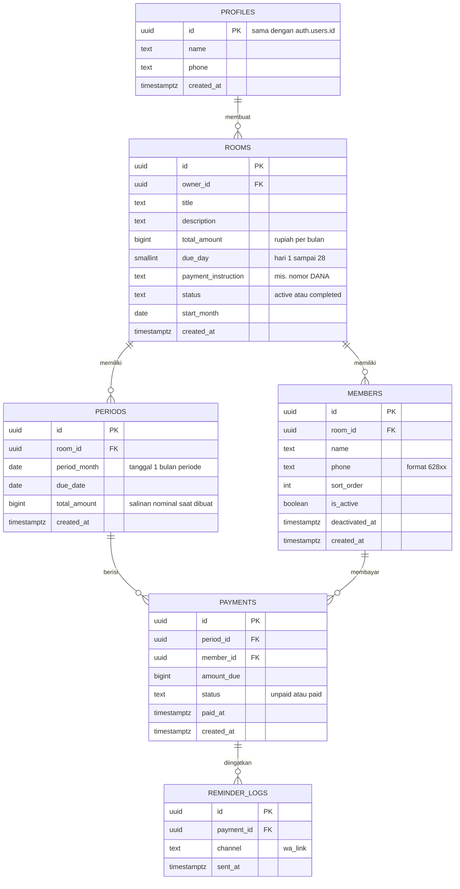
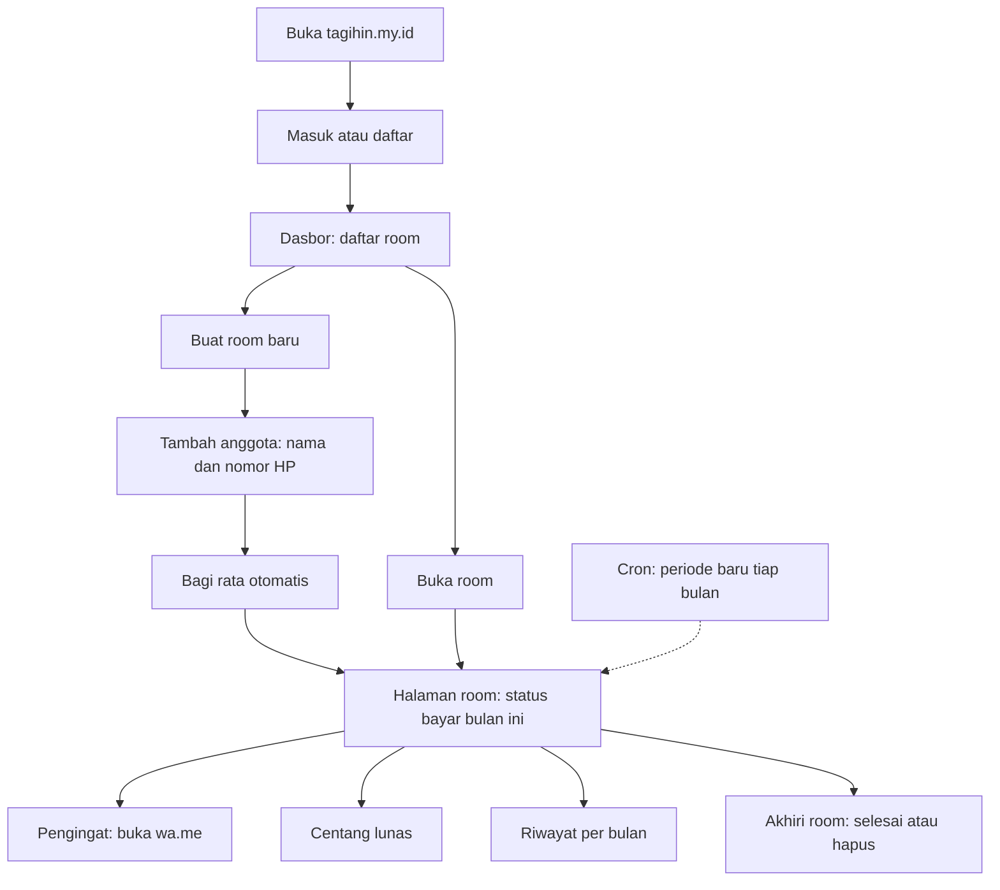
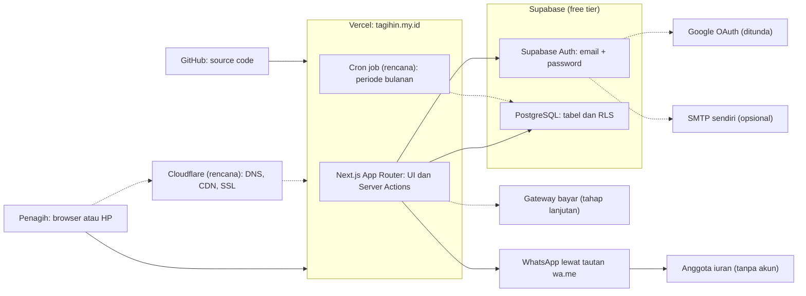

# PRD & ERD - TagihIn

**Mata kuliah:** Kewirausahaan · **Project lead:** Adip Habibullah · **Tahun:** 2026 · **Versi:** Draf 3 (9 Oktober 2026) **Stack:** Next.js (App Router) · Supabase (Auth + PostgreSQL) · Vercel · pengingat lewat tautan `wa.me`

> Tanda **\[Validasi\]** berarti pernyataan itu masih asumsi dan harus dibuktikan lewat pilot, bukan fakta. Wawancara tidak dilakukan, jadi masalah di bagian 1 berstatus hipotesis.

---

## 1. Problem Statement

Penagih iuran bersama (kos, kontrakan, lingkungan warga, kelas) umumnya mengelola iuran bulanan lewat chat grup dan catatan manual. Masalah yang diasumsikan (hipotesis, tidak divalidasi lewat wawancara, baru diuji lewat pilot):

1. Sulit melacak siapa yang sudah dan belum membayar setiap bulan.
2. Penagih mengetik ulang pesan pengingat ke tiap anggota setiap bulan.
3. Riwayat pembayaran bulan-bulan sebelumnya tidak terdokumentasi rapi.
4. Pembagian nominal per orang dihitung manual dan rawan salah, terutama bila ada sisa pembagian.

**TagihIn** adalah aplikasi web yang membantu penagih membuat "room" iuran, mengelola anggota, membagi tanggungan secara otomatis, mencatat status bayar per bulan, dan mengirim pengingat satu klik lewat WhatsApp. Pembayaran tetap dilakukan di luar sistem (transfer DANA atau tunai), dan penagih menandai status lunas.

Pembanding utama bukan aplikasi lain, melainkan **grup WhatsApp + catatan manual**. Nilai tambah TagihIn harus terbukti lebih cepat dan lebih rapi dari cara itu.

---

## 2. Goals

| ID | Tujuan | Indikator keberhasilan (target) | Cara ukur |
| --- | --- | --- | --- |
| G1 | Penagih cepat memulai | Membuat room beserta anggotanya selesai dalam \< 3 menit | Uji pengguna |
| G2 | Pengingat ringan | Dari daftar anggota ke pesan WhatsApp terisi dalam ≤ 2 klik | Uji alur |
| G3 | Pembagian akurat | Jumlah seluruh tanggungan anggota selalu sama dengan total iuran periode (100%) | Uji otomatis |
| G4 | Riwayat tidak hilang | Status bayar setiap bulan tersimpan dan dapat dilihat ulang | Uji alur multi-periode |
| G5 | Hipotesis dievaluasi | Setelah pilot, tiap masalah di bagian 1 dicatat sebagai terbukti, sebagian, atau tidak terbukti | Catatan pilot |
| G6 | Bukti pemakaian | Dipakai di 1-2 kelompok iuran nyata selama pilot | Catatan pilot |
| G7 | Biaya nol | Seluruh komponen berjalan di tier gratis | Audit stack |

Target di atas adalah target tugas, bukan hasil yang sudah tercapai.

---

## 3. Target Users

**Pengguna utama - Penagih iuran (pengepul).** Orang yang mengumpulkan dan mencatat iuran: mahasiswa pengurus kos/kontrakan, bendahara kelas, pengurus lingkungan. Memiliki akun, nyaman memakai ponsel dan WhatsApp. Kebutuhan: pelacakan cepat, pengingat tanpa mengetik ulang, riwayat.

**Pengguna sekunder - Anggota iuran.** Penghuni atau peserta yang membayar iuran. **Tidak memiliki akun**; hanya tercatat sebagai nama dan nomor HP, dan menerima pengingat dari nomor WhatsApp penagih.

**Segmen awal pilot:** kos dan kontrakan mahasiswa. Segmen lain (lingkungan warga, kelas, kepanitiaan) diperlakukan sebagai perluasan (hipotesis).

---

## 4. User Stories

| ID | Sebagai | Saya ingin | Agar | Prioritas |
| --- | --- | --- | --- | --- |
| US-01 | Penagih | masuk dengan akun (email/Google) | data room saya privat dan tersimpan | Must |
| US-02 | Penagih | membuat room iuran dengan judul, total nominal per bulan, tanggal jatuh tempo, dan info cara pembayaran | iuran terdefinisi jelas | Must |
| US-03 | Penagih | menambah, mengubah, dan menonaktifkan anggota (nama + nomor HP) | daftar anggota selalu sesuai kondisi | Must |
| US-04 | Penagih | nominal dibagi rata otomatis ke anggota | tidak menghitung manual | Must |
| US-05 | Penagih | melihat daftar anggota, status bayar bulan ini, dan total terkumpul | tahu siapa yang belum bayar | Must |
| US-06 | Penagih | mencentang anggota yang sudah bayar (dan membatalkannya) | status selalu mutakhir | Must |
| US-07 | Penagih | menekan tombol pengingat yang membuka WhatsApp dengan pesan terisi | tidak mengetik pengingat berulang | Must |
| US-08 | Penagih | periode baru terbentuk otomatis tiap bulan | tidak perlu membuat tagihan ulang | Must |
| US-09 | Penagih | melihat riwayat pembayaran per bulan | punya catatan yang bisa dirujuk | Should |
| US-10 | Penagih | menyelesaikan atau menghapus room | room yang sudah tidak dipakai tidak mengganggu | Must |
| US-11 | Penagih | mengubah total nominal mulai bulan berikutnya | iuran bisa menyesuaikan tanpa merusak riwayat | Should |
| US-12 | Penagih | mengekspor rekap periode ke CSV | punya arsip di luar aplikasi | Could |
| US-13 | Penagih | membaca kebijakan privasi | tahu bagaimana nama dan nomor HP anggota diperlakukan | Should |

---

## 5. Functional Requirements

| ID | Kebutuhan fungsional | Prioritas | Story |
| --- | --- | --- | --- |
| FR-01 | Autentikasi penagih memakai Supabase Auth. Anggota tidak memiliki akun. | Must | US-01 |
| FR-02 | CRUD room: judul, deskripsi, total nominal (rupiah bulat, > 0), tanggal jatuh tempo (hari 1-28), info pembayaran (teks bebas, mis. nomor DANA), status aktif/selesai. | Must | US-02 |
| FR-03 | CRUD anggota: nama dan nomor HP. Nomor dinormalkan ke format internasional (`08xx` menjadi `628xx`). Nomor ganda dalam satu room ditolak. Anggota yang keluar dinonaktifkan, bukan dihapus, agar riwayat tetap utuh. | Must | US-03 |
| FR-04 | Pembagian rata: tanggungan = lantai(total ÷ jumlah anggota aktif); sisa pembagian dibebankan ke anggota urutan pertama. Jumlah seluruh tanggungan harus selalu sama dengan total periode. | Must | US-04 |
| FR-05 | Pembuatan periode bulanan: otomatis lewat cron harian, ditambah pembuatan sesuai kebutuhan saat room dibuka sebagai cadangan. Idempotent (satu periode per room per bulan). Periode menyimpan salinan total nominal dan membuat satu baris pembayaran per anggota aktif. | Must | US-08 |
| FR-06 | Perubahan anggota atau nominal berlaku mulai periode berikutnya. Periode berjalan boleh dihitung ulang hanya bila belum ada anggota yang berstatus lunas. | Must | US-03, US-11 |
| FR-07 | Dasbor room: daftar anggota, status bayar, total terkumpul dan kekurangan, tanggal jatuh tempo, penanda terlambat. | Must | US-05 |
| FR-08 | Centang lunas manual dengan pencatatan waktu; dapat dibatalkan. | Must | US-06 |
| FR-09 | Tombol pengingat membuka `wa.me/<nomor>?text=...` berisi template (judul iuran, jatuh tempo, total, nominal per orang, info pembayaran). Hanya untuk anggota berstatus belum bayar. Pesan terkirim dari WhatsApp milik penagih. Klik dicatat di log pengingat. | Must | US-07 |
| FR-10 | Halaman riwayat: daftar periode beserta status bayar tiap anggota. | Should | US-09 |
| FR-11 | Selesaikan room (tidak membuat periode baru, data tetap tersimpan) dan hapus room (dengan konfirmasi, data terkait ikut terhapus). | Must | US-10 |
| FR-12 | Ekspor rekap periode ke CSV. | Could | US-12 |
| FR-13 | Halaman kebijakan privasi: data yang disimpan (nama dan nomor HP anggota, data akun penagih), tujuan, siapa yang dapat melihat, dan cara penghapusan. Dibuat sebelum pilot. | Should | US-13 |

---

## 6. Non-Functional Requirements

| Kategori | Kebutuhan |
| --- | --- |
| Keamanan | Row Level Security Supabase: penagih hanya bisa mengakses room miliknya. Kunci rahasia hanya di sisi server. Seluruh akses lewat HTTPS. |
| Privasi | Nomor HP anggota hanya terlihat oleh penagih pemilik room. Sediakan halaman kebijakan privasi (FR-13), dibuat sebelum pilot. Kewajiban menurut UU Pelindungan Data Pribadi pada skala tugas **perlu diverifikasi**. |
| Integritas data | Nominal disimpan sebagai bilangan bulat rupiah. Batasan database: unik per (room, bulan) dan unik per (periode, anggota). |
| Keandalan | Pembuatan periode aman dijalankan ulang (idempotent). Mitigasi Supabase free tier yang dapat berhenti sementara saat tidak aktif: periksa dan aktifkan database sebelum demo dan pilot **\[Validasi batas terbaru\]**. |
| Performa | Target halaman room dengan 50 anggota termuat \< 2 detik di jaringan seluler. Perlu diuji. |
| Usability | Mobile-first, responsif mulai lebar 360 px, antarmuka berbahasa Indonesia, alur utama minim klik. |
| Waktu | Tanggal jatuh tempo dan periode memakai zona WIB. Cron berjalan di UTC, jadi konversi harus diuji. |
| Biaya | Seluruh komponen memakai tier gratis. Batas tier perlu dicek ulang di halaman resmi tiap layanan. |
| Pemeliharaan | Skema dikelola lewat berkas migrasi SQL yang berversi. Kode memakai TypeScript. |

---

## 7. Scope

**Dalam lingkup (in scope)**

- Autentikasi penagih, CRUD room dan anggota, pembagian rata, periode bulanan otomatis, checklist status, riwayat, pengingat `wa.me`, selesaikan/hapus room.
- Deployment di Vercel + Supabase, dan halaman kebijakan privasi.
- Pengujian lapangan: pilot di 1-2 kelompok nyata (tanpa wawancara).

**Di luar lingkup (out of scope) - pengembangan lanjutan**

- Pembayaran online (QRIS/Virtual Account) dan konfirmasi otomatis lewat webhook. Butuh verifikasi bisnis untuk mode production dan dikenai biaya transaksi; dampak biayanya perlu dianalisis di model bisnis.
- Pengiriman WhatsApp otomatis lewat API (resmi berbayar, tidak resmi berisiko diblokir).
- Pembagian tidak rata, iuran sekali bayar tanpa siklus, banyak penagih per room, aplikasi mobile native, notifikasi push.

**Asumsi dan batasan**

- Anggota tidak memiliki akun.
- Uang tidak melewati sistem, sehingga status lunas bergantung pada penagih.

**Item terbuka yang perlu keputusan atau verifikasi**

1. Model pendapatan produk masih berupa hipotesis di BMC (bagian 11) dan belum teruji.
2. Info pembayaran (mis. nomor DANA) disimpan per room (asumsi dokumen ini) atau per penagih?
3. Aturan sisa pembagian: dibebankan ke anggota pertama (sementara) atau ke penagih?
4. Batas free tier Vercel dan Supabase perlu dicek ulang sebelum dipakai.

---

## 8. ERD

### Aturan integritas dan keamanan data

| Aturan | Tujuan |
| --- | --- |
| `UNIQUE (room_id, period_month)` pada `periods` | Satu periode per room per bulan; pembuatan periode aman dijalankan ulang oleh cron |
| `UNIQUE (period_id, member_id)` pada `payments` | Satu tagihan per anggota per periode |
| `UNIQUE (room_id, phone)` pada `members` | Mencegah anggota ganda |
| `CHECK (due_day BETWEEN 1 AND 28)` dan `CHECK (total_amount > 0)` | Menghindari tanggal tidak valid di bulan pendek dan nominal tidak masuk akal |
| Jumlah `amount_due` per periode = `periods.total_amount` | Dijaga di fungsi pembagian dan diuji otomatis |
| `ON DELETE CASCADE` dari `rooms` ke tabel turunannya | Menghapus room membersihkan seluruh data terkait |
| Anggota dinonaktifkan (`is_active = false`), tidak dihapus | Riwayat pembayaran periode lalu tetap utuh |
| RLS: akses `rooms`, `members`, `periods`, `payments` hanya untuk `owner_id` yang sesuai | Penagih tidak bisa melihat data penagih lain |

---

## 9. Alur Pengguna (Penagih)

Alur ini adalah draf. Tidak ada wawancara untuk mengujinya, jadi evaluasi sebenarnya terjadi saat pilot.

---

## 10. Arsitektur Infrastruktur

Garis putus-putus berarti rencana, opsional, atau ditunda.

Catatan: Redis, Nginx, dan read replica sengaja tidak digambar karena tidak ada di rencana TagihIn. Deploy dilakukan langsung dari GitHub ke Vercel.

---

## 11. Business Model Canvas (Draf, Berbasis Hipotesis)

> Seluruh isi di bawah belum divalidasi lewat wawancara atau data pasar.

| Blok | Isi |
| --- | --- |
| Segmen pelanggan | Utama: penagih iuran bulanan di kos atau kontrakan mahasiswa. Sekunder: bendahara kelas dan pengurus iuran lingkungan. Anggota iuran adalah pengguna tidak langsung (tanpa akun). |
| Proposisi nilai | Status bayar semua anggota terlihat sekilas, pembagian rata otomatis, pengingat WhatsApp satu klik tanpa mengetik ulang, riwayat per bulan, gratis untuk memulai. |
| Saluran | Web app (tagihin.my.id), rekomendasi dari mulut ke mulut di grup WhatsApp kos atau kelas, demo langsung ke pengurus iuran. |
| Hubungan pelanggan | Swalayan lewat aplikasi, bantuan lewat chat atau email. |
| Sumber pendapatan | Belum teruji. Kandidat: (1) freemium, gratis sampai batas anggota atau room tertentu, berbayar di atasnya; (2) langganan bulanan kecil untuk penagih; (3) jangka panjang, biaya layanan bila pembayaran online diaktifkan. |
| Sumber daya kunci | Kode aplikasi (Next.js + Supabase), domain, tim pengembang, data nomor HP anggota (diatur lewat kebijakan privasi). |
| Aktivitas kunci | Pengembangan dan pemeliharaan, pembuatan periode bulanan otomatis, penyusunan kebijakan privasi dan penjagaan keamanan data, dukungan pengguna, promosi. |
| Mitra kunci | Vercel dan Supabase (infrastruktur), WhatsApp (kanal pengingat lewat tautan), penyedia payment gateway (tahap lanjutan). |
| Struktur biaya | Domain `.my.id`, hosting dan database (saat ini tier gratis, bisa berbayar bila melewati batas), waktu pengembang, promosi, biaya gateway (tahap lanjutan). |

**Titik lemah yang diakui:** proposisi nilai belum terbukti lebih baik dari grup WhatsApp + catatan manual; kesediaan membayar belum diketahui; kanal pengingat bergantung pada WhatsApp; infrastruktur bergantung pada batas free tier.

---

## 12. Timeline dan Bobot (Revisi)

| Minggu | Periode | Fokus Fase | Bobot | Kumulatif |
| --- | --- | --- | --- | --- |
| 1 | 29 Sep - 5 Okt | Setup Web & Supabase Auth (Google OAuth ditunda) | 10% | 10% |
| 2 | 6 - 12 Okt | Requirement Analysis & Perancangan | 15% | 25% |
| 3 | 13 - 19 Okt | Skema Database & Core Room | 20% | 45% |
| 4 | 20 - 26 Okt | Checklist, Periode & Pengingat | 20% | 65% |
| 5 | 27 Okt - 2 Nov | Pengujian & Pilot (termasuk halaman kebijakan privasi) | 15% | 80% |
| 6 | 3 - 9 Nov | Analisis Bisnis, Dokumentasi & Presentasi | 20% | 100% |
| 7 | 10 - 16 Nov | Buffer | 0% | 100% |

Bobot adalah estimasi beban kerja, bukan data.