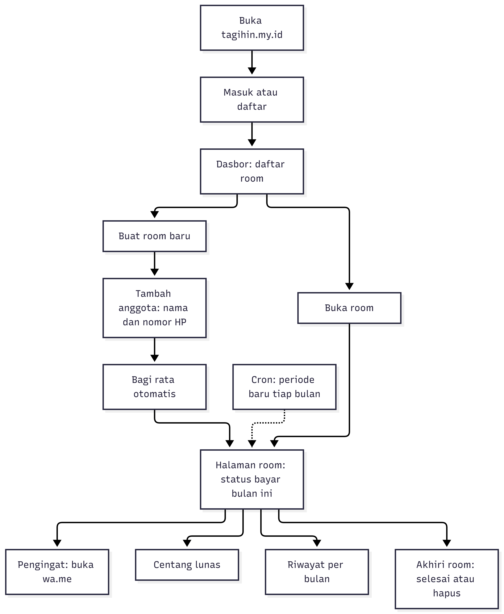
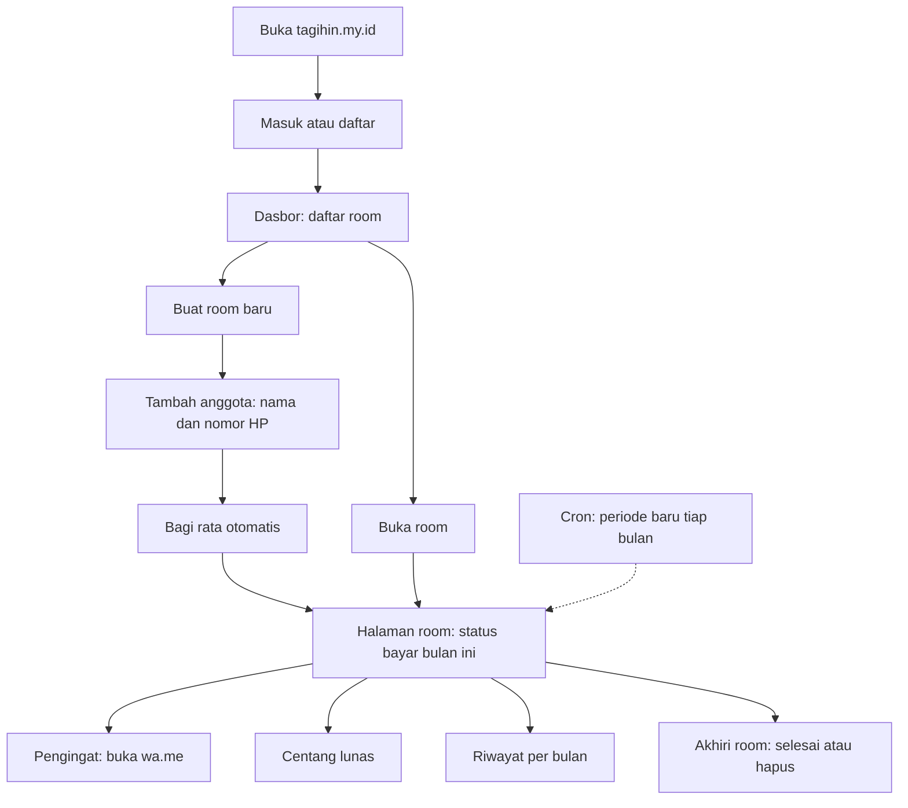
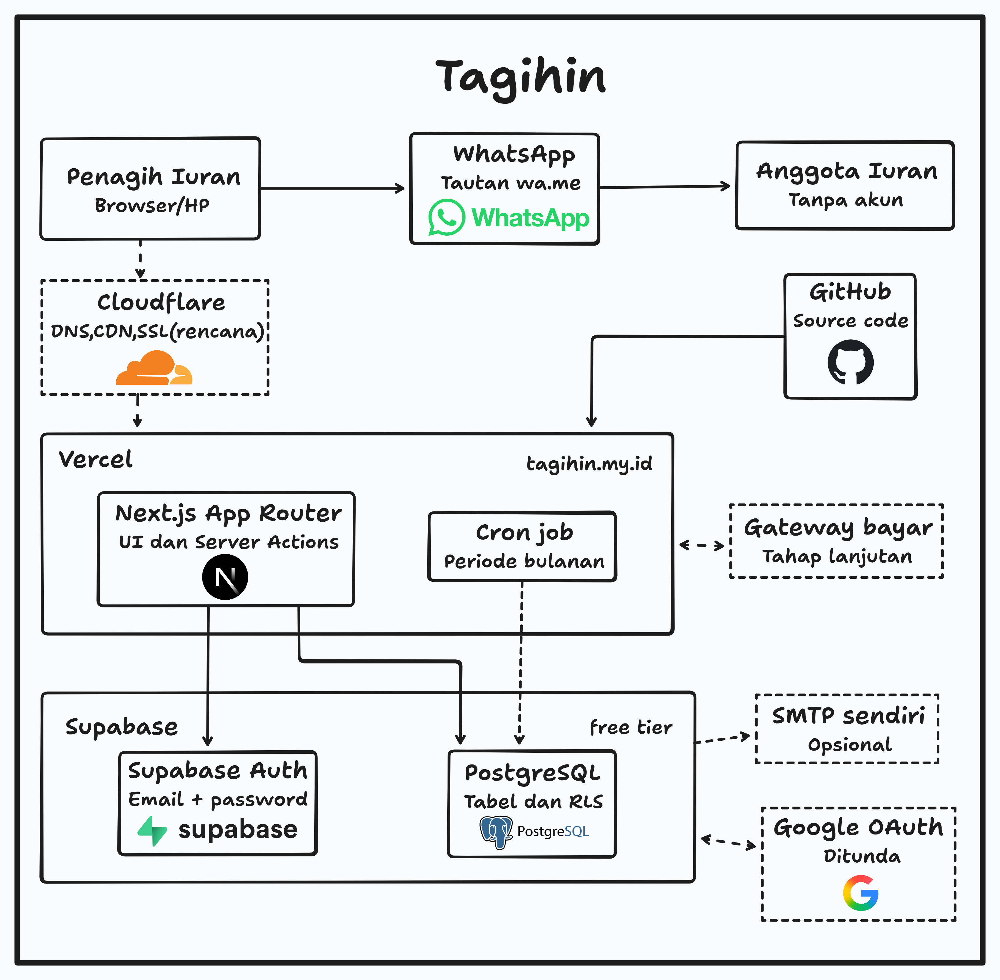
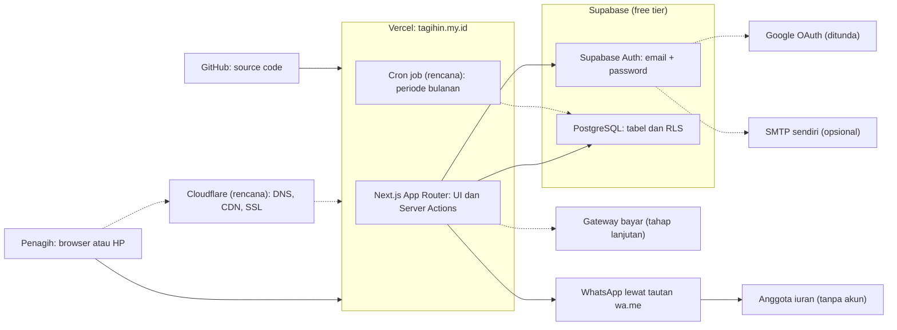
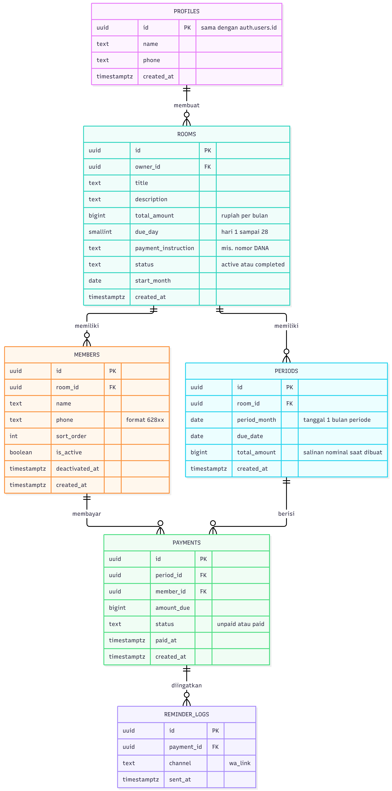
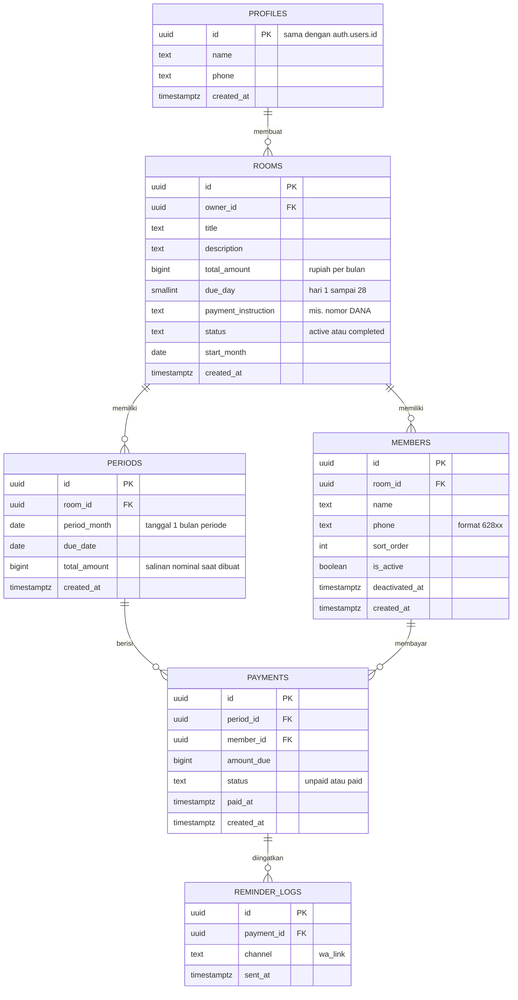

<!--
  PANDUAN MENUKAR DIAGRAM DENGAN GAMBAR
  Simpan 3 file gambar ini di folder docs/images/ pada repositori:
    - erd.png            -> bagian "Skema Database (ERD)"
    - alur-penagih.png   -> bagian "Alur Penagih"
    - infrastruktur.png  -> bagian "Arsitektur Infrastruktur"
  Format .svg juga bisa, cukup ubah ekstensi di tag  terkait.
  Diagram Mermaid di dalam <details> adalah cadangan dan boleh dihapus kalau gambar sudah terpasang.
-->

<div align="center">

# TagihIn

**Kelola iuran bersama tanpa ribet: bagi rata otomatis, catat siapa yang sudah bayar, ingatkan lewat WhatsApp.**

[](https://nextjs.org)
[](https://supabase.com)
[](https://vercel.com)


[Situs](https://tagihin.my.id/) · [Alur Penagih](#alur-penagih) · [Infrastruktur](#arsitektur-infrastruktur) · [ERD](#skema-database-erd) · [Memulai](#memulai)

</div>

---

## Tentang

Iuran bulanan di kos, kontrakan, kelas, atau lingkungan warga umumnya dikelola lewat chat grup dan catatan manual. TagihIn adalah aplikasi web untuk **penagih iuran**: buat room iuran, masukkan anggota (nama dan nomor HP), dan aplikasi membagi tanggungan secara rata setiap bulan.

Masalah yang ingin diselesaikan (masih berupa hipotesis dan akan diuji lewat pilot):

- Sulit melacak siapa yang sudah dan belum membayar tiap bulan.
- Pengingat harus diketik ulang ke setiap anggota.
- Riwayat pembayaran bulan lalu tidak terdokumentasi rapi.
- Pembagian nominal per orang dihitung manual.

> **Catatan:** uang tidak melewati sistem. Pembayaran dilakukan di luar aplikasi (transfer atau tunai), dan penagih menandai status lunas sendiri. Anggota tidak perlu membuat akun.

## Fitur

**Sudah berjalan**

- [x] Setup Next.js dan deploy ke Vercel
- [x] Login email + password (Supabase Auth)

**Dalam rencana**

- [ ] Skema database dan Row Level Security (RLS)
- [ ] Room iuran dan manajemen anggota (nama + nomor HP)
- [ ] Pembagian rata otomatis
- [ ] Periode bulanan otomatis
- [ ] Checklist status lunas dan riwayat per bulan
- [ ] Pengingat WhatsApp satu klik (tautan `wa.me`, terkirim dari nomor penagih)
- [ ] Halaman kebijakan privasi

**Ditunda atau tahap lanjutan**

- [ ] Login dengan Google
- [ ] Pembayaran online (QRIS/Virtual Account)

## Alur Penagih

<div align="center">
  
</div>

<details>
<summary>Versi teks (Mermaid)</summary>



</details>

## Arsitektur Infrastruktur

<div align="center">
  
</div>

Garis putus-putus pada diagram berarti rencana, opsional, atau ditunda. Deploy dilakukan langsung dari GitHub ke Vercel.

<details>
<summary>Versi teks (Mermaid)</summary>



</details>

## Skema Database (ERD)

<div align="center">
  
</div>

<details>
<summary>Versi teks (Mermaid)</summary>



</details>

**Aturan data penting:** satu periode per room per bulan, satu tagihan per anggota per periode, nominal berupa bilangan bulat rupiah, anggota dinonaktifkan (bukan dihapus) agar riwayat tetap utuh, dan RLS membatasi akses hanya untuk penagih pemilik room.

## Teknologi

| Lapisan | Teknologi |
|---|---|
| Frontend dan server | Next.js (App Router) |
| Autentikasi | Supabase Auth |
| Database | Supabase PostgreSQL (dengan RLS) |
| Hosting | Vercel (deploy otomatis dari GitHub) |
| Pengingat | Tautan `wa.me` |
| Rencana | Cloudflare, cron job, Google OAuth, payment gateway |

## Memulai

**Prasyarat:** Node.js, akun Supabase, dan akun Vercel (opsional untuk deploy).

```bash
git clone https://github.com/RegaCode4/tagihin.git
cd tagihin
npm install
```

Buat berkas `.env.local` di root proyek:

```env
NEXT_PUBLIC_SUPABASE_URL=https://<project-ref>.supabase.co
NEXT_PUBLIC_SUPABASE_ANON_KEY=<anon-key>
```

> Nama variabel mengikuti kode di repositori ini. Sesuaikan bila berbeda.

Di dashboard Supabase, pada pengaturan Authentication, tambahkan `http://localhost:3000` dan `https://tagihin.my.id` ke daftar URL redirect yang diizinkan. Lalu jalankan:

```bash
npm run dev
```

Buka `http://localhost:3000`.

**Deploy:** hubungkan repositori ke Vercel, tambahkan variabel lingkungan yang sama di pengaturan proyek Vercel. Setiap push ke branch produksi akan langsung mengubah situs live, jadi kerjakan fitur baru di branch terpisah.

## Keterbatasan

- Status lunas dicatat manual oleh penagih, bukan otomatis.
- Pengingat dikirim lewat WhatsApp milik penagih sendiri, bukan pengiriman otomatis.
- Menyimpan nama dan nomor HP anggota; ketentuannya akan dijelaskan di halaman kebijakan privasi.
- Berjalan di tier gratis Vercel dan Supabase, sehingga tunduk pada batas layanan masing-masing.

## Tim

- **Project Lead:** Adip Habibullah
- **Konteks:** tugas mata kuliah Kewirausahaan, 2026
